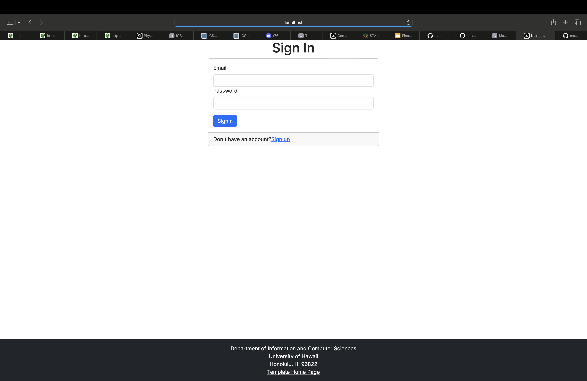
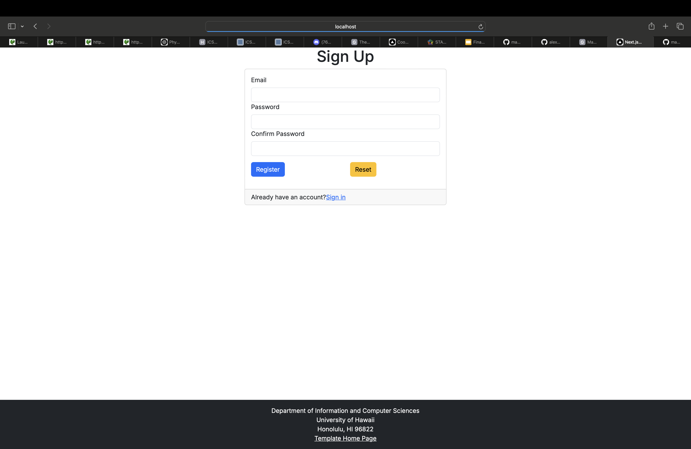
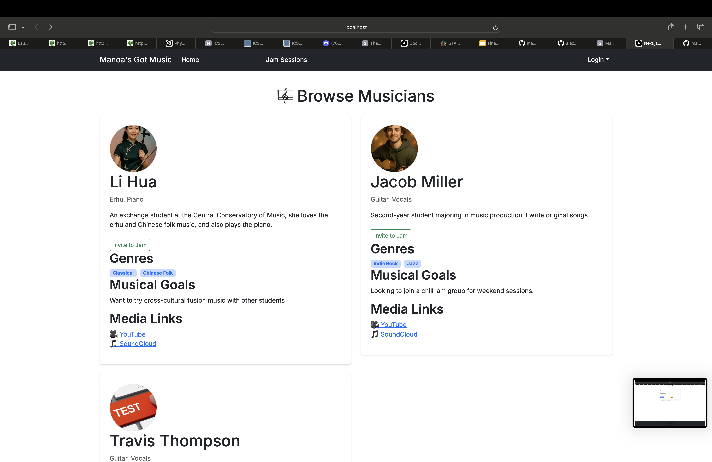
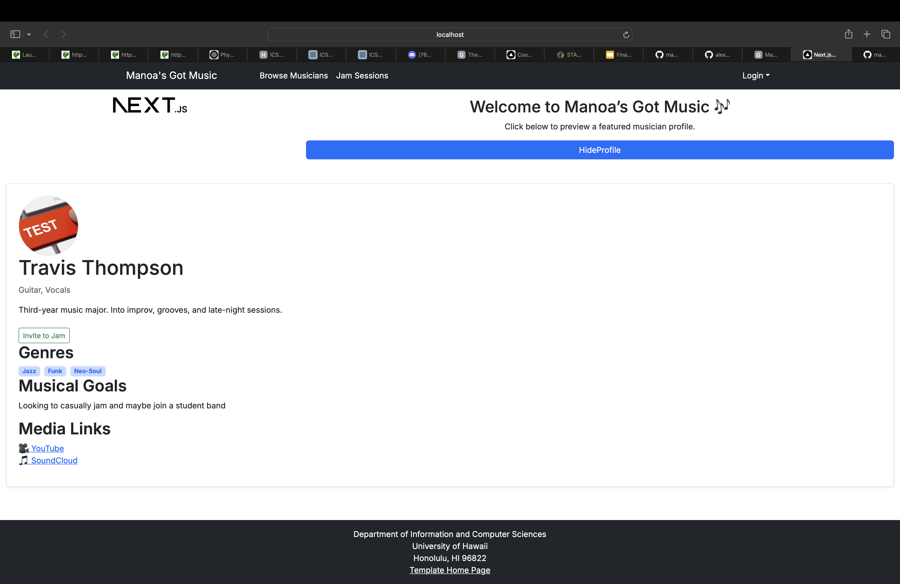
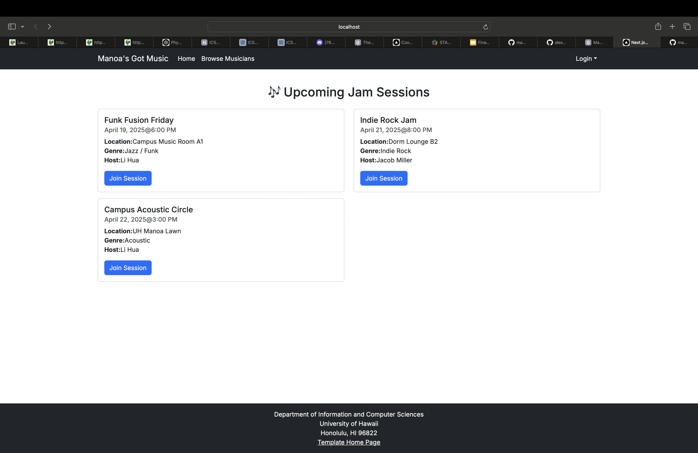

# 🎶 Manoa's Got Music

##  Overview

**The Problem**: Many UH students are musically talented, but lack an easy way to find others with similar tastes and compatible musical abilities. This prevents informal jam sessions and the formation of musical groups.

**The Solution**:  
*Manoa's Got Music* is a web application that allows students to:
- Create a profile with their musical tastes, skills, and goals.
- Share links to performances (YouTube/SoundCloud).
- Connect with other students for collaboration or jam sessions.

###  Technologies Used
- [Next.js](https://nextjs.org/) – TypeScript-based framework for server and client code
- [React](https://reactjs.org/) – Component-based UI library
- [React Bootstrap](https://react-bootstrap.github.io/) – UI framework for styling
- [React Hook Form](https://react-hook-form.com/) – Form management
- [Prisma](https://www.prisma.io/) – Type-safe ORM for database interaction

##  Project Goals
- Foster musical collaboration among UH students
- Enable exploration of new genres and instruments
- Make it easy to find compatible musicians for jamming or bands

##  Features
- 🎵 Create a musical profile (genres, instruments, goals)
- 🔗 Share performance links (YouTube, SoundCloud)
- 🔍 Filter and browse musicians by interests and availability
- 📬 Contact other users to organize jam sessions

##  Organization & Repositories
- GitHub Organization: [manoas-got-music](https://github.com/manoas-got-music)
- Source Code: [manoas-source-code](https://github.com/manoas-got-music/manoas-source-code)

## 🌐 Deployment
- **Live App**: [Vercel Deployment](https://source-code-jaydas-projects-6bafb85b.vercel.app/)
- **CI Status**:  
[](https://github.com/manoas-got-music/manoas-source-code/actions/workflows/ci.yml)
## 👥 User Guide
*Manoa’s Got Music* is a free platform created by UH students for UH students.  
You can:
1. Create a profile with your instruments, genres, and goals.
2. Add videos or audio links of your music.
3. Explore profiles and message others to set up jam sessions.

Whether you're casually looking to jam or forming the next great band — it's your choice!

## 📅 Project Boards
- **[M1 Project Board](https://github.com/orgs/manoas-got-music/projects/1)**
- **[M2 Project Board](https://github.com/orgs/manoas-got-music/projects/2)**
- **[M3 Project Board](https://github.com/orgs/manoas-got-music/projects/3)**

##  Mockups (M1)
> **Click to enlarge** (hosted locally via `img/` folder):

<p align="center"><br/><em>Sign In Page</em></p>
<p align="center"><br/><em>Sign Up Page</em></p>
<p align="center"><br/><em>Browse Musicians Page</em></p>
<p align="center"><br/><em>User Profile Page</em></p>
<p align="center"><br/><em>Jam Session Page</em></p>

##  Developer Guide

Welcome to the developer guide for *Manoa’s Got Music*!  
This guide walks you through setting up, running, and contributing to the project.

###  Prerequisites
Make sure the following are installed:
- [Node.js](https://nodejs.org/) (LTS or version specified in `package.json`)
- npm or yarn
- [PostgreSQL](https://www.postgresql.org/) (for the database)
- Git
- Optional: VS Code, GitHub Desktop

###  Getting Started

1. **Clone the Repository**
   ```bash
   git clone https://github.com/manoas-got-music/manoas-source-code.git
   cd manoas-source-code
   ```

2. **Install Dependencies**
   ```bash
   npm install
   # or
   yarn install
   ```

3. **Set Up Environment Variables**
   ```bash
   cp .env.example .env
   ```
   Then edit `.env` with your database info:
   ```
   DATABASE_URL=postgresql://<user>:<password>@localhost:5432/manoasgotmusic
   NEXTAUTH_SECRET=<generate-a-secret>
   NEXTAUTH_URL=http://localhost:3000
   ```

4. **Database Setup**
   ```bash
   npx prisma db push
   # Optional: Seed with test data
   npx prisma db seed
   ```

5. **Run the App**
   ```bash
   npm run dev
   ```
   Visit [http://localhost:3000](http://localhost:3000) to access the app locally.

###  Project Structure

```plaintext
src/
├── app/                # Route and layout logic
├── components/         # UI components (e.g. Navbar, Profile)
├── lib/                # Utilities and Prisma client
pages/api/              # API routes
prisma/                 # Database schema and migrations
public/img/             # Images and mockups
```

###  Code Standards
- Run linter before committing:
  ```bash
  npm run lint
  ```
- Follow Issue-Driven Project Management (IDPM).
- Use GitHub Projects for task tracking.

## 👨‍👩‍👧‍👦 Team

| Name              | GitHub Profile                                          |
|-------------------|---------------------------------------------------------|
| Justin Mito       | [@justinvmito](https://justinvmito.github.io)           |
| Alexander Edwards | [@alex-edwards-44](https://alex-edwards-44.github.io)   |
| Colin Ohlund      | [@Cohlund876](https://Cohlund876.github.io)             |
| Jayda Decker      | [@jaydald](https://jaydald.github.io)                   |
| Yueming Guo       | [@YuemingGuo9](https://github.com/YuemingGuo9)         |

📄 **[Team Contract](https://docs.google.com/document/d/13MF7s-PhaulhlaJWpAjXyL4SHC6C8agoXo6tztl9ILw/edit?tab=t.0)**

## 🏫 ICS 314 Spring 2025

This project was developed as part of **ICS 314: Software Engineering**  
**University of Hawai‘i at Mānoa**

### Contact Instructors

| Name         | Email                |
|--------------|----------------------|
| Cam Moore    | cmoore@hawaii.edu    |
| Chad Morita  | chadmmm@hawaii.edu   |
| Dan Port     | dport@hawaii.edu     |
| Brook Conner | dbconner@hawaii.edu  |
