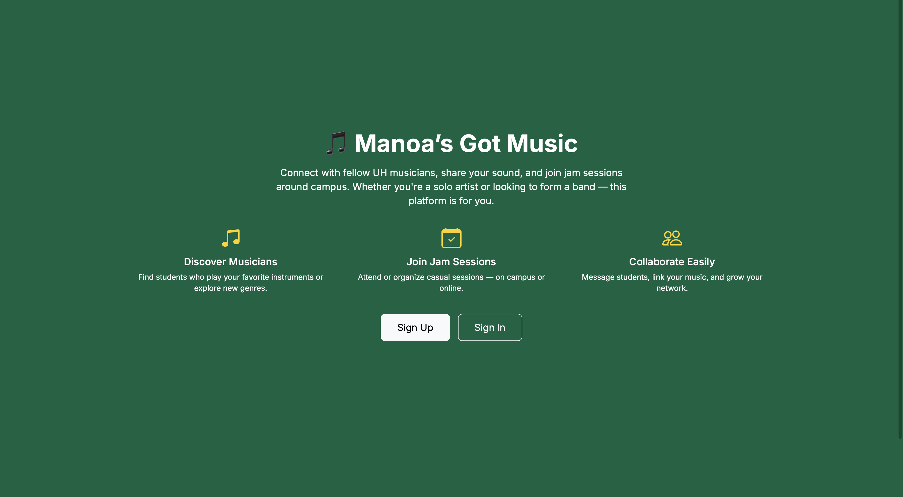
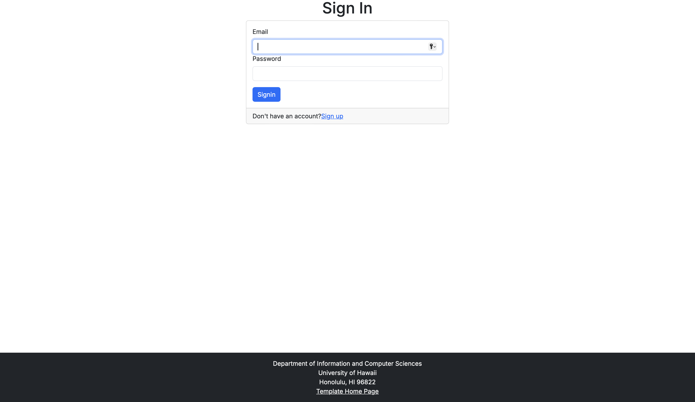
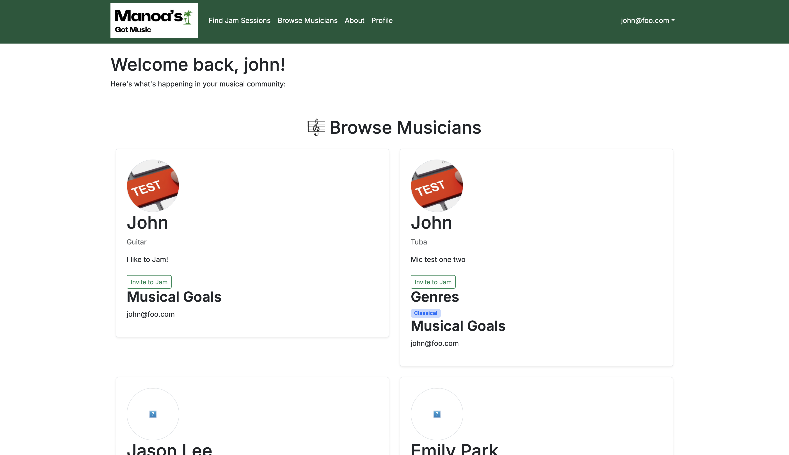
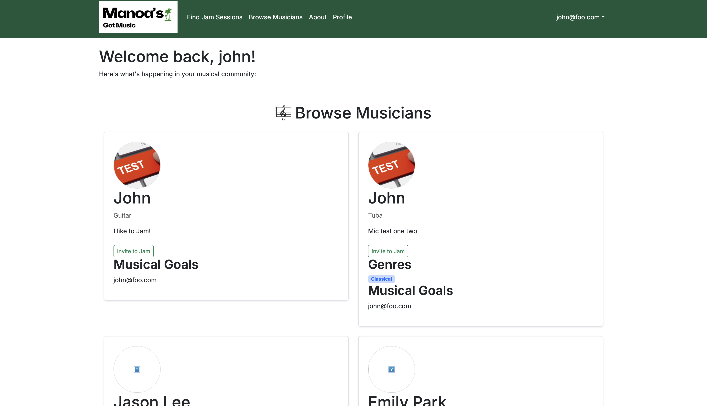
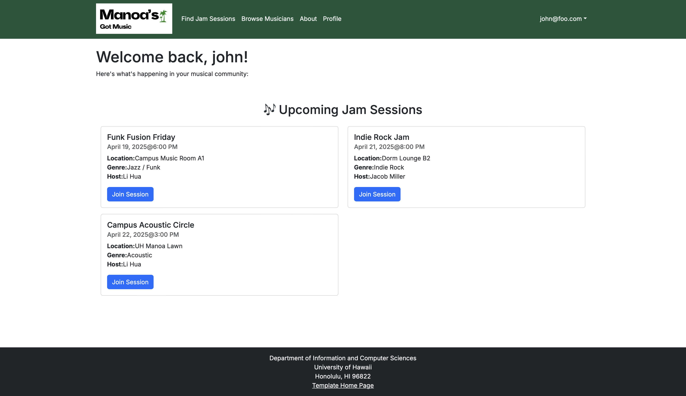

# 🎶 Manoa's Got Music

##  Overview

**The Problem**: Many UH students are musically talented, but lack an easy way to find others with similar tastes and compatible musical abilities. This prevents informal jam sessions and the formation of musical groups.

**The Solution**:  
*Manoa's Got Music* is a web application that allows students to:
- Create a profile with their musical tastes, skills, and goals.
- Share links to performances (YouTube/SoundCloud).
- Connect with other students for collaboration or jam sessions.

###  Technologies Used
- [Next.js](https://nextjs.org/) – TypeScript-based framework for server and client code
- [React](https://reactjs.org/) – Component-based UI library
- [React Bootstrap](https://react-bootstrap.github.io/) – UI framework for styling
- [React Hook Form](https://react-hook-form.com/) – Form management
- [Prisma](https://www.prisma.io/) – Type-safe ORM for database interaction

##  Project Goals
- Foster musical collaboration among UH students
- Enable exploration of new genres and instruments
- Make it easy to find compatible musicians for jamming or bands

##  Features
- 🎵 Create a musical profile (genres, instruments, goals)
- 🔗 Share performance links (YouTube, SoundCloud)
- 🔍 Filter and browse musicians by interests and availability
- 📬 Contact other users to organize jam sessions

##  Organization & Repositories
- GitHub Organization: [manoas-got-music](https://github.com/manoas-got-music)
- Source Code: [manoas-source-code](https://github.com/manoas-got-music/manoas-source-code)

## 🌐 Deployment
- **Live App**: [Vercel Deployment](https://manoas-source-code-c37p37aok-jaydas-projects-6bafb85b.vercel.app/)
- **CI Status**: [](https://github.com/manoas-got-music/manoas-source-code/actions/workflows/ci.yml)
## 👥 User Guide
*Manoa’s Got Music* is a free platform created by UH students for UH students.  
You can:
1. Create a profile with your instruments, genres, and goals.
2. Add videos or audio links of your music.
3. Explore profiles and message others to set up jam sessions.

Whether you're casually looking to jam or forming the next great band — it's your choice!

## 📅 Project Boards
- **[M1 Project Board](https://github.com/orgs/manoas-got-music/projects/1)**
- **[M2 Project Board](https://github.com/orgs/manoas-got-music/projects/2)**
- **[M3 Project Board](https://github.com/orgs/manoas-got-music/projects/3)**

##  Mockups (M1)
> **Click to enlarge** (hosted locally via `img/` folder):

<p align="center"><br/><em>Sign In Page</em></p>
<p align="center"><br/><em>Sign Up Page</em></p>
<p align="center"><br/><em>Browse Musicians Page</em></p>
<p align="center"><br/><em>User Profile Page</em></p>
<p align="center"><br/><em>Jam Session Page</em></p>

##  Developer Guide

Welcome to the developer guide for *Manoa’s Got Music*!  
This guide walks you through setting up, running, and contributing to the project.

###  Prerequisites
Make sure the following are installed:
- [Node.js](https://nodejs.org/) (LTS or version specified in `package.json`)
- npm or yarn
- [PostgreSQL](https://www.postgresql.org/) (for the database)
- Git
- Optional: VS Code, GitHub Desktop

###  Getting Started

1. **Clone the Repository**
   ```bash
   git clone https://github.com/manoas-got-music/manoas-source-code.git
   cd manoas-source-code
   ```

2. **Install Dependencies**
   ```bash
   npm install
   # or
   yarn install
   ```

3. **Set Up Environment Variables**
   ```bash
   cp .env.example .env
   ```
   Then edit `.env` with your database info:
   ```
   DATABASE_URL=postgresql://<user>:<password>@localhost:5432/manoasgotmusic
   NEXTAUTH_SECRET=<generate-a-secret>
   NEXTAUTH_URL=http://localhost:3000
   ```

4. **Database Setup**
   ```bash
   npx prisma db push
   # Optional: Seed with test data
   npx prisma db seed
   ```

5. **Run the App**
   ```bash
   npm run dev
   ```
   Visit [http://localhost:3000](http://localhost:3000) to access the app locally.

###  Project Structure

```plaintext
src/
├── app/                # Route and layout logic
├── components/         # UI components (e.g. Navbar, Profile)
├── lib/                # Utilities and Prisma client
pages/api/              # API routes
prisma/                 # Database schema and migrations
public/img/             # Images and mockups
```

###  Code Standards
- Run linter before committing:
  ```bash
  npm run lint
  ```
- Follow Issue-Driven Project Management (IDPM).
- Use GitHub Projects for task tracking.

## User Guide

This guide explains how to navigate and use the core features of **Manoa’s Got Music**. Each section corresponds to a major page or feature currently implemented in the application.

### 1. Landing Page



The landing page gives users a brief introduction to the purpose of Manoa’s Got Music. It explains how the app helps UH students connect through music and encourages them to sign up or log in.

---

### 2. Sign In



The sign-in page allows returning users to log in securely using their credentials. New users can follow the link to create an account.

---

### 3. Dashboard



After logging in, users are directed to their dashboard. From here, they can navigate to their profile, browse other musicians, view jam sessions, or log out.

---

### 4. Browse Musicians



On the Browse Musicians page, users can explore profiles of other musicians. Filtering options help users find musicians with similar interests, genres, instruments, or collaboration goals.

---

### 5. Jam Sessions



This page displays current or upcoming jam sessions. Users can browse sessions, learn more about them, and express interest in joining. It's a hub for musical collaboration.

---


## Community Feedback

As part of our community testing, we asked five individuals outside of ICS 314 to try out Manoa’s Got Music and provide feedback on their experience.

### Key Findings
- **In-App Messaging**: The most common request was the addition of a private messaging feature inside the app. Testers expressed that they would feel more comfortable communicating within the app, rather than having to share private contact information up front.
- **Public Events Calendar**: Several testers recommended a feature to display a public calendar of musical events and performances around Oahu. They suggested allowing users to browse and submit events to foster musical collaboration and awareness.
- **User Interface Improvements**: Some feedback pointed to areas where the app’s UI could be made more visually polished, including better format on mobile devices.

### Future Considerations
We greatly appreciate this feedback and have added these recommendations to our future development roadmap:
- Integrate a secure in-app messaging system.
- Develop a community events calendar.
- Refine and enhance the user interface for an even better user experience.

## 👨‍👩‍👧‍👦 Team

| Name              | GitHub Profile                                          |
|-------------------|---------------------------------------------------------|
| Justin Mito       | [@justinvmito](https://justinvmito.github.io)           |
| Alexander Edwards | [@alex-edwards-44](https://alex-edwards-44.github.io)   |
| Colin Ohlund      | [@Cohlund876](https://Cohlund876.github.io)             |
| Jayda Decker      | [@jaydald](https://jaydald.github.io)                   |
| Yueming Guo       | [@YuemingGuo9](https://github.com/YuemingGuo9)         |

📄 **[Team Contract](https://docs.google.com/document/d/13MF7s-PhaulhlaJWpAjXyL4SHC6C8agoXo6tztl9ILw/edit?tab=t.0)**

##  M3 Checkpoint
## Deliverables
The final milestone, M3, represents the culmination of all development efforts for Manoa’s Got Music. This includes complete feature implementation, UI polish, testing, and user feedback integration.

## Final Features
🎼 Fully functional musical profile creation and matching

🔍 Filter musicians by genres and goals

🔗 Performance links display directly on user profiles

## UI/UX Improvements

Updated mobile layout for better accessibility

Improved spacing and visual hierarchy across components

Added feedback indicators for form submission and validation

## Testing & QA

Manual user testing across 3+ browsers

Community testing with 5+ external users

Linting and CI pipelines enforced for all PRs

Deployed on Vercel with CI status badges

## Community Feedback Integration

Suggestions from external users:

Future in-app messaging and event calendar now planned

Adjusted design based on UI/UX comments


## 🏫 ICS 314 Spring 2025

This project was developed as part of **ICS 314: Software Engineering**  
**University of Hawai‘i at Mānoa**

### Contact Instructors

| Name         | Email                |
|--------------|----------------------|
| Cam Moore    | cmoore@hawaii.edu    |
| Chad Morita  | chadmmm@hawaii.edu   |
| Dan Port     | dport@hawaii.edu     |
| Brook Conner | dbconner@hawaii.edu  |
